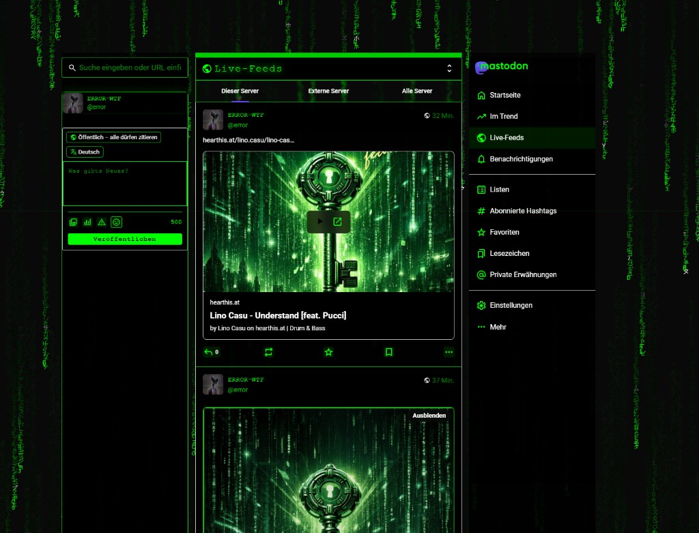

# 🟢 Mastodon Matrix Theme

[](https://github.com/mastodon/mastodon)
[](https://anticapitalist.software/)
[](https://github.com/error-wtf/mastodon-matrix-theme/releases)

> 🎬 A cyberpunk Matrix-style theme for [Mastodon](https://github.com/mastodon/mastodon) - the decentralized social network.

A complete theme package featuring an interactive terminal landing page, matrix rain animations, custom emojis, and full deployment configurations.



## 🔗 Links

- **Original Mastodon:** [github.com/mastodon/mastodon](https://github.com/mastodon/mastodon)
- **Live Demo:** *Deploy your own instance to see it in action!*
- **Issues:** [Report bugs](https://github.com/error-wtf/mastodon-matrix-theme/issues)

## ✨ Features

| Feature | Description |
|---------|-------------|
| 🎨 **Matrix Theme** | Full SCSS theme with 3200+ lines of cyberpunk styling |
| 🌧️ **Matrix Rain** | Animated falling code background (Web Worker based) |
| 💻 **Terminal Landing** | Interactive CLI landing page with bot protection |
| 🤖 **Pseudo-AI Chat** | Chat with Neo, Morpheus, Trinity, Oracle, Smith |
| 🎮 **Easter Eggs** | Hidden Tetris game! |
| 🎨 **Color Variants** | Green, Red, Blue, Purple themes |
| 😀 **120+ Emojis** | Custom hacker/tech themed emojis |
| ⌨️ **Theme Toggle** | Ctrl+Shift+M to toggle theme |
| 🔒 **Bot Protection** | Terminal challenge before login |
| 🐳 **Docker Ready** | nginx.conf & systemd service included |

## 📁 File Structure

```
mastodon-matrix-theme/
├── README.md                           # This file
├── LICENSE                             # AGPLv3 License
├── install.sh                          # Installation helper script
│
├── styles/                             # 🎨 SCSS Themes
│   ├── matrix_theme.scss               # Full theme (3200+ lines, toggle)
│   └── matrix_theme_standalone.scss    # Simple always-on version
│
├── js/                                 # 💻 JavaScript
│   ├── matrix_rain.js                  # Matrix rain + splash screen
│   ├── matrix_background.js            # Alternative background effect
│   └── matrix_theme.ts                 # Theme toggle controller (TS)
│
├── terminal/                           # 🖥️ Landing Page Terminal
│   ├── index.html                      # Interactive terminal page
│   ├── main.js                         # Terminal JavaScript
│   ├── main.css                        # Terminal styles
│   ├── tetris.html                     # 🎮 Easter egg: Tetris!
│   ├── tetris-script.js                # Tetris game logic
│   ├── tetris-style.css                # Tetris styles
│   └── talk_db_*.json                  # Pseudo-AI chat character databases
│
├── emojis/                             # 😀 120+ Custom Emojis
│   ├── hacker.svg                      # Hacker face
│   ├── matrix_code.svg                 # Matrix code
│   ├── terminal.svg                    # Terminal icon
│   ├── coffee_code.svg                 # Coding with coffee
│   ├── red_pill.svg / blue_pill.svg    # Matrix pills
│   └── ... (120+ more)
│
├── rails/                              # 🛤️ Rails Integration
│   ├── matrix_controller.rb            # Terminal routes controller
│   ├── initializers/
│   │   └── matrix_theme.rb             # Theme configuration
│   ├── entrypoints/
│   │   └── common.ts                   # JS entrypoint example
│   └── views/
│       └── application_layout_snippet.haml  # Layout modifications
│
├── deploy/                             # 🐳 Deployment Files
│   ├── nginx.conf                      # nginx configuration
│   └── mastodon-matrix.service         # systemd service file
│
├── docs/                               # 📚 Documentation
│   └── FRONTEND_MAP_MATRIX_AND_STYLES.md
│
└── screenshots/
    └── preview.png                     # Theme preview
```

---

## 🚀 Installation

### Method 1: Standalone Theme (Always On)

Best for instances that want Matrix as the default look.

```bash
# 1. Copy standalone SCSS
cp styles/matrix_theme_standalone.scss \
   /path/to/mastodon/app/javascript/styles/

# 2. Import in Mastodon's main SCSS
echo '@import "matrix_theme_standalone";' >> \
   /path/to/mastodon/app/javascript/styles/application.scss

# 3. Copy Matrix rain JS
cp js/matrix_rain.js \
   /path/to/mastodon/app/javascript/errordon/matrix/index.js

# 4. Rebuild assets
cd /path/to/mastodon
RAILS_ENV=production bundle exec rails assets:precompile
```

### Method 2: Toggleable Theme (Ctrl+Shift+M)

Best for instances that want theme as an option.

```bash
# 1. Copy full theme SCSS
cp styles/matrix_theme.scss \
   /path/to/mastodon/app/javascript/styles/errordon_matrix.scss

# 2. Copy theme controller
mkdir -p /path/to/mastodon/app/javascript/mastodon/features/errordon/
cp js/matrix_theme.ts \
   /path/to/mastodon/app/javascript/mastodon/features/errordon/

# 3. Copy Matrix rain
mkdir -p /path/to/mastodon/app/javascript/errordon/matrix/
cp js/matrix_rain.js js/matrix_background.js \
   /path/to/mastodon/app/javascript/errordon/matrix/

# 4. Update common.ts entrypoint
# Add to app/javascript/entrypoints/common.ts:
# import { initMatrixTheme } from 'mastodon/features/errordon/matrix_theme';
# import '@/errordon/matrix/index.js';
# initMatrixTheme();

# 5. Rebuild assets
cd /path/to/mastodon
RAILS_ENV=production bundle exec rails assets:precompile
```

---

## 🖥️ Terminal Landing Page Installation

The Matrix Terminal is a separate landing page with interactive CLI.

### Install Terminal

```bash
# 1. Copy terminal files to public folder
cp -r terminal/ /path/to/mastodon/public/matrix/

# 2. Copy Rails controller
cp rails/matrix_controller.rb \
   /path/to/mastodon/app/controllers/

# 3. Add routes to config/routes.rb
cat << 'EOF' >> /path/to/mastodon/config/routes.rb

# Matrix Terminal
get '/matrix', to: 'matrix#index'
post '/matrix/pass', to: 'matrix#pass'
EOF

# 4. Restart Mastodon
systemctl restart mastodon-web mastodon-sidekiq
```

### Terminal Commands

| Command | Effect |
|---------|--------|
| `enter matrix` | Proceed to main site |
| `help` | Show available commands |
| `neo` / `morpheus` / `trinity` | Chat with characters |
| `oracle` / `smith` | More characters |
| `tetris` | 🎮 Play hidden Tetris game! |
| `clear` | Clear terminal |
| `exit` | Close terminal |

---

## 🎨 Color Variants

Set via environment variable:

```bash
# In .env.production
MATRIX_COLOR=green    # Classic (default)
MATRIX_COLOR=red      # Aggressive red
MATRIX_COLOR=blue     # Cyber blue
MATRIX_COLOR=purple   # Cyberpunk purple
```

---

## 😀 Custom Emojis Installation

> **Recommended:** Use `install.sh` which automatically converts SVGs to high-quality PNGs.

### Automatic Installation (Recommended)

```bash
# Requires ImageMagick for best quality
apt install imagemagick

# Run installer - converts all SVGs to 128x128 PNGs
./install.sh /path/to/mastodon
```

### Manual Installation

```bash
# 1. Convert SVG emojis to PNG (128x128) for best display
mkdir -p /path/to/mastodon/public/emoji/custom
for svg in emojis/*.svg; do
    name=$(basename "$svg" .svg)
    convert -background none -resize 128x128 "$svg" \
        "/path/to/mastodon/public/emoji/custom/${name}.png"
done

# 2. OPTIONAL: Copy political emojis (pre-converted PNGs)
# These include: :acab: :antifa: :fcknzs: :no_nazis: :resist: :anarchist: :antifascist: :naturfreund:
cp emojis/*.png /path/to/mastodon/public/emoji/custom/

# 3. Import via Rails console (or tootctl)
cd /path/to/mastodon
RAILS_ENV=production bin/rails c

# In Rails console:
Dir.glob('public/emoji/custom/*.png').each do |path|
  shortcode = File.basename(path, '.png')
  CustomEmoji.find_or_create_by!(shortcode: shortcode) do |e|
    e.image = File.open(path)
    e.visible_in_picker = true
  end
end
```

> **Note:** The `install.sh` script will ask if you want to include political emojis.

### Popular Emojis Included

| Emoji | Shortcode | Description |
|-------|-----------|-------------|
| 💊 | `:red_pill:` `:blue_pill:` | Matrix pills |
| 👨‍💻 | `:hacker:` | Hacker face |
| 🐱 | `:hacker_cat:` | Hacker cat |
| ☕ | `:coffee_code:` | Code & coffee |
| 🖥️ | `:terminal:` | Terminal |
| 🐧 | `:linux:` `:tux:` | Linux |
| 🐳 | `:docker:` | Docker |
| 🔒 | `:vpn:` `:tor:` | Privacy |
| 💀 | `:skull_matrix:` | Matrix skull |
| 🤖 | `:robot:` `:cyborg:` | Robots |

### 🏴 Political Emojis (Optional)

These are included but **optional** during installation:

| Emoji | Shortcode | Description |
|-------|-----------|-------------|
| 🏴 | `:acab:` | 1312 |
| 🏴 | `:antifa:` | Antifascist Action logo |
| 🏴 | `:fcknzs:` | FCK NZS |
| 🏴 | `:no_nazis:` | NO NZS |
| 🏴 | `:resist:` | RESIST |
| 🏴 | `:anarchist:` | ANARCHY |
| 🏴 | `:antifascist:` | ANTIFA |
| 🌿 | `:naturfreund:` | Naturfreunde |

---

## 🐳 Docker / nginx Deployment

### nginx Configuration

```bash
# Copy nginx config
sudo cp deploy/nginx.conf /etc/nginx/sites-available/mastodon-matrix

# Edit and replace 'example.com' with your domain
sudo nano /etc/nginx/sites-available/mastodon-matrix

# Enable site
sudo ln -sf /etc/nginx/sites-available/mastodon-matrix \
            /etc/nginx/sites-enabled/

# Get SSL certificate
sudo certbot --nginx -d yourdomain.com

# Test and reload
sudo nginx -t && sudo systemctl reload nginx
```

### systemd Service

```bash
# Copy service file
sudo cp deploy/mastodon-matrix.service \
        /etc/systemd/system/mastodon.service

# Edit paths if needed
sudo nano /etc/systemd/system/mastodon.service

# Enable and start
sudo systemctl daemon-reload
sudo systemctl enable mastodon
sudo systemctl start mastodon
```

---

## ⚙️ Environment Variables

```bash
# Theme settings
MATRIX_THEME_ENABLED=true            # Enable Matrix theme by default
MATRIX_THEME=matrix                  # Theme name
MATRIX_COLOR=green                   # Color variant

# Terminal protection
MATRIX_TERMINAL_ENABLED=true         # Require terminal before login
```

---

## 🔧 Customization

### Modify Colors

Edit `styles/matrix_theme.scss`:

```scss
// Near the top of the file
$matrix-primary: #00ff00;        // Main green
$matrix-background: #000000;     // Background
$matrix-text: #00ff00;           // Text color
```

### Disable Matrix Rain

Comment out in `rails/entrypoints/common.ts`:

```typescript
// import '@/errordon/matrix/index.js';
```

### Change Terminal Messages

Edit `terminal/talk_db_*.json` files for character responses.

---

## 🏷️ Rebrand to Your Instance Name

Want to change "Matrix" to your own instance name? Use the rebrand scripts:

### Linux/macOS
```bash
./rebrand.sh "YourInstanceName"
```

### Windows PowerShell
```powershell
.\rebrand.ps1 -NewName "YourInstanceName"
```

### What Gets Changed

| Category | Before | After |
|----------|--------|-------|
| Display names | MATRIX TERMINAL | YOURNAME TERMINAL |
| Terminal prompt | `guest@matrix:~$` | `guest@yourname:~$` |
| Environment vars | `MATRIX_THEME` | `YOURNAME_THEME` |
| Ruby namespace | `Matrix::` | `Yourname::` |
| File names | `matrix_theme.rb` | `yourname_theme.rb` |

📖 See [docs/BRANDING.md](docs/BRANDING.md) for detailed manual instructions.

---

## 📝 License

**Theme & Code:** [Anti-Capitalist Software License 1.4](https://anticapitalist.software/)

**Emojis:**
- **OpenMoji** (most tech emojis): [CC BY-SA 4.0](https://creativecommons.org/licenses/by-sa/4.0/) - https://openmoji.org
- **Political emojis** (acab, antifa, fcknzs, etc.): Custom designs, free to use

> OpenMoji emojis by the OpenMoji project (https://openmoji.org). License: CC BY-SA 4.0

---

## 🙏 Credits

- **[Mastodon](https://github.com/mastodon/mastodon)** - Original software by Eugen Rochko & contributors
- **[OpenMoji](https://openmoji.org)** - Open source emoji library (CC BY-SA 4.0) - Created by students at HfG Schwäbisch Gmünd
- **Matrix Theme** - Developed by the Errordon team
- **Inspiration** - "The Matrix" (1999) by the Wachowskis

---

## 🆘 Support

- **GitHub Issues:** [Report bugs](https://github.com/error-wtf/mastodon-matrix-theme/issues)
- **Mastodon:** *Open an issue on GitHub for support*

---

## ⭐ Star History

If you like this theme, please give it a star! It helps others discover it.

---

<p align="center">
  <a href="https://github.com/mastodon/mastodon">
    
  </a>
</p>
